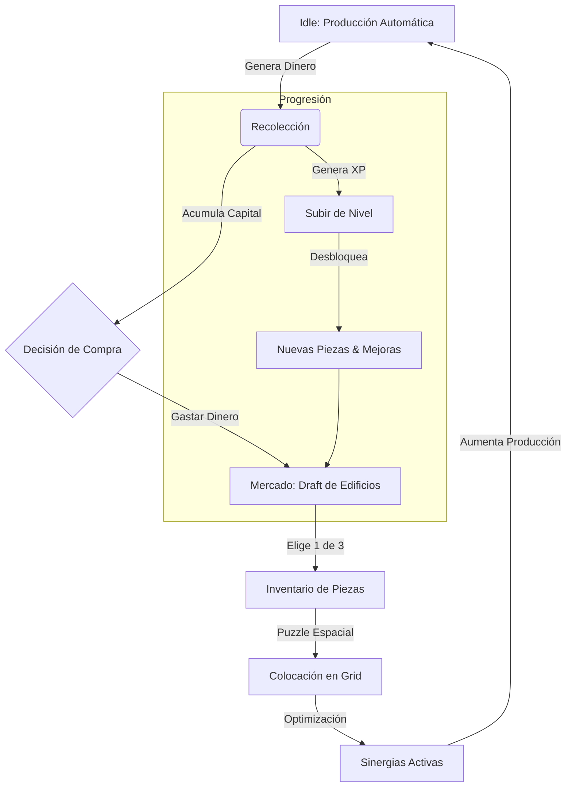

# Farm SiK-Ness - Game Design Document (GDD)
**Versión:** 0.0.1-Alpha (Pre-release)
**Fecha:** 24 Noviembre 2025
**Estado:** Diseño Aprobado

---

## 1. Resumen Ejecutivo
**Farm SiK-Ness** es un juego de gestión incremental (Idle) con mecánicas de puzzle espacial. El jugador gestiona una granja en una cuadrícula limitada, donde debe optimizar la colocación de edificios con formas tipo "Tetris" para maximizar la producción mediante sinergias de adyacencia.

*   **Hook (Gancho):** "No es solo qué construyes, sino *dónde* y *cómo* lo encajas."
*   **Plataforma:** PC & Mobile (Cross-platform).
*   **Motor:** Godot 4.5.1.

---

## 2. Bucle de Juego (Core Loop)

El ciclo principal se basa en la optimización constante del espacio y los recursos.



---

## 3. Mecánicas y Algoritmos

### 3.1. Sistema de Grid y Construcción (Puzzle)
El terreno es una matriz finita. Cada edificio es un `Polyomino` (forma geométrica compuesta de cuadrados).

*   **Lógica:**
    *   El jugador arrastra una pieza del inventario al grid.
    *   **Validación:** `CheckCollision(x, y, shape_array)` -> Debe estar dentro de límites y no solapar.
    *   **Rotación:** Permitida (90º).
    *   **Movimiento:** Edificios ya colocados pueden moverse (Modo Edición).

*   **Algoritmo de Sinergia (Adyacencia):**
    ```python
    func calculate_production(building):
        multiplier = 1.0
        neighbors = get_adjacent_cells(building)
        for neighbor in neighbors:
            if neighbor.has_tag(building.synergy_required):
                multiplier += building.synergy_bonus
        return building.base_production * multiplier
    ```

### 3.2. Sistema de Mercado (Draft Dinámico)
Para evitar la monotonía de una tienda estática, usamos un sistema de "Draft" o selección de cartas.

*   **Funcionamiento:**
    1.  El jugador abre el Mercado.
    2.  Se presentan **3 Cartas** aleatorias (Edificios).
    3.  El jugador compra una. Las otras se descartan.
    4.  El mercado se refresca (con coste incremental o tiempo).

*   **Algoritmo de Selección (Weighted Random):**
    *   `Pool`: Lista de todos los `BuildingData` desbloqueados por nivel.
    *   `Weight (Peso)`: `BaseRarity / (PlayerLevel * 0.1)`. (Ajustable para balance).
    *   Se eligen 3 items basados en su peso acumulado.

### 3.3. Sistema Idle (Offline)
Cálculo determinista al reabrir el juego.

*   **Algoritmo:**
    ```python
    time_diff = current_unix_time() - last_save_time()
    total_offline_earnings = 0
    
    for building in placed_buildings:
        # Producción por segundo ya calculada con sinergias
        building_earnings = building.production_per_sec * time_diff
        total_offline_earnings += building_earnings
        
    player.money += total_offline_earnings
    show_welcome_back_popup(total_offline_earnings)
    ```

---

## 4. Progresión y Recompensas

### 4.1. Niveles de Jugador
*   **Ganar XP:** Al recolectar recursos y al construir.
*   **Recompensa:**
    *   Nivel 5: Expansión de Grid (+1 fila/columna).
    *   Nivel 10: Desbloqueo de "Silos" (Almacenamiento).
    *   Nivel 15: Desbloqueo de "Ríos" (Modificadores de terreno).

### 4.2. Milestones de Edificio
Incentivo para mantener edificios antiguos.
*   **Nivel 10 (Bronce):** x2 Producción.
*   **Nivel 25 (Plata):** +1 Radio de efecto para sinergias.
*   **Nivel 50 (Oro):** Autorecolección instantánea.

---

## 5. Interfaz de Usuario (UI Mockups)

### 5.1. Pantalla Principal (HUD)
```text
+--------------------------------------------------+
| LVL 12 [====--]      $ 1,250,400       [⚙️ Menu] |
+--------------------------------------------------+
|                                                  |
|   [ Grid View - Zoomable / Pannable ]            |
|                                                  |
|      . . . [W] [W] . . . .                       |
|      . [C] [C] [W] . . . .    W = Water          |
|      . [C] [S] [C] . . . .    C = Crop           |
|      . . . [C] . . . . . .    S = Silo           |
|                                                  |
+--------------------------------------------------+
| [📦 Inventario]    [🛒 MERCADO]      [🏆 Misiones]|
| (3 items)          (¡Oferta!)        (2 activas) |
+--------------------------------------------------+
```

### 5.2. Ventana de Mercado (Draft)
```text
+--------------------------------------------------+
|                 MERCADO DE GRANJA                |
+--------------------------------------------------+
|  Elige un contrato para firmar:                  |
|                                                  |
|  +-----------+   +-----------+   +-----------+   |
|  |  HUERTO   |   |   POZO    |   |  MOLINO   |   |
|  |   [##]    |   |    [#]    |   |   [##]    |   |
|  |   [##]    |   |           |   |    [#]    |   |
|  |           |   |           |   |           |   |
|  | Prod: 10/s|   | Buff: Agua|   | Proc: x2  |   |
|  | $ 500     |   | $ 1200    |   | $ 5000    |   |
|  +-----------+   +-----------+   +-----------+   |
|      [Comprar]       [Comprar]       [Comprar]   |
|                                                  |
+--------------------------------------------------+
|          [ 🔄 Refrescar Ofertas ($ 100) ]        |
+--------------------------------------------------+
```

### 5.3. Inspector de Edificio
```text
+--------------------------------------------------+
| [X]              MOLINO DE VIENTO                |
+--------------------------------------------------+
| Nivel: 14  [=======---] (Next: x2 Prod at Lvl 25)|
|                                                  |
| Producción Base: 50/s                            |
| Sinergia (Trigo): +25/s [ACTIVO]                 |
| Sinergia (Viento): +0/s [INACTIVO]               |
| ------------------------------------------------ |
| TOTAL: 75/s                                      |
|                                                  |
| [ MEJORAR ($ 2500) ]      [ MOVER ]     [ VENDER ]|
+--------------------------------------------------+
```

---

## 6. Arquitectura Técnica (Godot)

### 6.1. Estructura de Archivos
*   `res://data/buildings/*.tres` -> Definición de piezas (Stats, Forma, Textura).
*   `res://scenes/grid/GridManager.tscn` -> Lógica del tablero.
*   `res://scenes/ui/HUD.tscn` -> Interfaz principal.
*   `user://savegame.json` -> Persistencia encriptada.

### 6.2. Configuración (Settings)
*   **Debug Mode:** Activado por `ProjectSettings` o secuencia secreta. Permite inyectar dinero y desbloquear piezas para testeo rápido.

---

## 7. Hoja de Ruta (Roadmap Alpha)

1.  **Semana 1:** Grid System, Resource Data, Colocación básica.
2.  **Semana 2:** Game Loop (Producción -> Dinero), UI Básica.
3.  **Semana 3:** Mercado (Draft), Save System.
4.  **Semana 4:** Sinergias, Pulido visual, Release 0.0.1.
